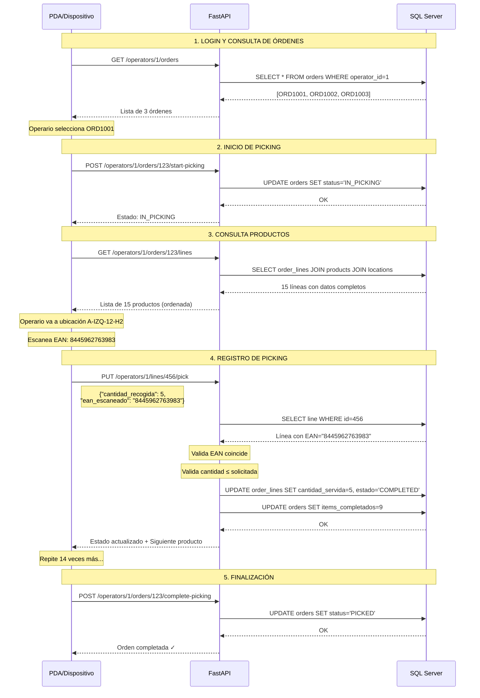

# 📊 Diagramas: Sistema PDA para Operadores

## 🔄 Diagrama de Flujo Completo



---

## 🗺️ Arquitectura del Sistema

```
┌─────────────────────────────────────────────────────────┐
│                     CAPA PDA (Frontend)                  │
│                                                          │
│  ┌──────────┐  ┌──────────┐  ┌──────────┐             │
│  │  Login   │  │  Órdenes │  │ Productos│             │
│  │  Screen  │→ │  Screen  │→ │  Screen  │             │
│  └──────────┘  └──────────┘  └──────────┘             │
│                                                          │
│  • Scanner EAN                                           │
│  • Caché local (offline)                                │
│  • UI optimizada para pantalla pequeña                  │
└─────────────────────────────────────────────────────────┘
                            ↓ HTTP/REST
┌─────────────────────────────────────────────────────────┐
│                   CAPA API (FastAPI)                     │
│                                                          │
│  ┌────────────────────────────────────────────────┐    │
│  │  operator_router.py                            │    │
│  │                                                 │    │
│  │  • GET    /operators/{id}/orders               │    │
│  │  • GET    /operators/{id}/orders/{id}/lines ⭐ │    │
│  │  • PUT    /operators/{id}/lines/{id}/pick      │    │
│  │  • POST   /operators/{id}/orders/{id}/start    │    │
│  │  • POST   /operators/{id}/orders/{id}/complete │    │
│  └────────────────────────────────────────────────┘    │
│                            ↓                             │
│  ┌────────────────────────────────────────────────┐    │
│  │  picking_service.py (Lógica de negocio)        │    │
│  │                                                 │    │
│  │  • validar_asignacion()                        │    │
│  │  • validar_ean()                               │    │
│  │  • actualizar_picking()                        │    │
│  │  • calcular_progreso()                         │    │
│  └────────────────────────────────────────────────┘    │
│                            ↓                             │
│  ┌────────────────────────────────────────────────┐    │
│  │  ORM Models (SQLAlchemy)                       │    │
│  │                                                 │    │
│  │  • Order                                        │    │
│  │  • OrderLine                                    │    │
│  │  • Operator                                     │    │
│  │  • ProductReference                             │    │
│  │  • ProductLocation                              │    │
│  └────────────────────────────────────────────────┘    │
└─────────────────────────────────────────────────────────┘
                            ↓ pyodbc
┌─────────────────────────────────────────────────────────┐
│               BASE DE DATOS (SQL Server)                 │
│                                                          │
│  ┌─────────────┐  ┌──────────────┐  ┌────────────┐    │
│  │   orders    │  │ order_lines  │  │  operators │    │
│  └─────────────┘  └──────────────┘  └────────────┘    │
│                                                          │
│  ┌─────────────┐  ┌──────────────────────────────┐    │
│  │  products   │  │  product_locations           │    │
│  └─────────────┘  └──────────────────────────────┘    │
└─────────────────────────────────────────────────────────┘
```

---

## 📦 Modelo de Datos (Relaciones)

```
┌──────────────┐
│   Operator   │
│─────────────│
│ id           │──┐
│ codigo       │  │
│ nombre       │  │
└──────────────┘  │
                  │ 1:N
        ┌─────────┴──────────┐
        │                    │
        ▼                    ▼
┌──────────────┐      ┌──────────────┐
│    Order     │      │ PickingTask  │
│─────────────│      │─────────────│
│ id           │──┐   │ id           │
│ numero_orden │  │   │ operator_id  │
│ operator_id  │←─┘   │ order_line_id│
│ status_id    │      │ secuencia    │
│ prioridad    │      └──────────────┘
└──────────────┘
        │ 1:N
        │
        ▼
┌──────────────┐
│  OrderLine   │
│─────────────│
│ id           │──┐
│ order_id     │  │
│ product_ref_id│←┼─────────┐
│ product_loc_id│←┼────┐    │
│ cantidad_sol │  │    │    │
│ cantidad_ser │  │    │    │
│ estado       │  │    │    │
└──────────────┘  │    │    │
                  │    │    │
        ┌─────────┘    │    │
        │              │    │
        ▼              │    │
┌──────────────┐      │    │
│ProductLocation      │    │
│─────────────│      │    │
│ id           │←─────┘    │
│ product_id   │───────────┤
│ codigo_ubic  │           │
│ pasillo      │           │
│ lado         │           │
│ altura       │           │
│ stock_actual │           │
└──────────────┘           │
                           │
                           │
                    ┌──────┘
                    │
                    ▼
             ┌──────────────┐
             │ProductReference
             │─────────────│
             │ id           │
             │ referencia   │
             │ nombre       │
             │ color        │
             │ talla        │
             │ ean          │
             │ sku          │
             └──────────────┘
```

---

## 🔄 Estados de Orden (Transiciones)

```
        ┌──────────┐
        │ PENDING  │  (Importada, sin asignar)
        └────┬─────┘
             │ assign_operator()
             ▼
        ┌──────────┐
        │ ASSIGNED │  (Operario asignado)
        └────┬─────┘
             │ start_picking()
             ▼
        ┌──────────┐
        │IN_PICKING│  (Operario recogiendo productos)
        └────┬─────┘
             │ complete_picking()
             ▼
        ┌──────────┐
        │  PICKED  │  (Productos recogidos)
        └────┬─────┘
             │ pack_order()
             ▼
        ┌──────────┐
        │ PACKING  │  (Empacando)
        └────┬─────┘
             │ mark_ready()
             ▼
        ┌──────────┐
        │  READY   │  (Lista para envío)
        └────┬─────┘
             │ ship_order()
             ▼
        ┌──────────┐
        │ SHIPPED  │  (Enviada)
        └──────────┘

        (En cualquier momento: CANCELLED)
```

---

## 📱 Flujo de Usuario (UI)

```
╔═══════════════════════╗
║   PDA - Login         ║
╚═══════════════════════╝
        │
        │ Código: OP001
        ▼
╔═══════════════════════╗
║  Mis Órdenes (3)      ║
╠═══════════════════════╣
║ ORD1001  HIGH   8/15  ║ ← Selecciona
║ ORD1002  NORM   0/10  ║
║ ORD1003  URG   12/12  ║
╚═══════════════════════╝
        │
        ▼
╔═══════════════════════╗
║  ORD1001 - Productos  ║
╠═══════════════════════╣
║ Progreso: 8/15 (53%)  ║
║ ████████░░░░░░░       ║
╠═══════════════════════╣
║                       ║
║ PASILLO A (5 items)   ║
║ ├ A-IZQ-12  ✓ 5/5    ║
║ ├ A-DER-14  ⚠ 3/5    ║ ← Actual
║ └ A-IZQ-16  ○ 0/2    ║
║                       ║
║ PASILLO B3 (4 items)  ║
║ ├ B3-DER-05 ○ 0/8    ║
║ └ ...                 ║
║                       ║
║ [Completar] [Pausar]  ║
╚═══════════════════════╝
        │
        │ Toca A-DER-14
        ▼
╔═══════════════════════╗
║  📍 A-DER-14 (H2)     ║
╠═══════════════════════╣
║ Camisa Polo M Azul    ║
║ EAN: 8445962763990    ║
║                       ║
║ Solicita: 5           ║
║ Recogido: 3           ║
║ Pendiente: 2          ║
║                       ║
║ ┌───────────────────┐ ║
║ │ [Escanear EAN]    │ ║ ← Escanea
║ └───────────────────┘ ║
║                       ║
║ Cantidad: [ 5 ] ✓     ║
║                       ║
║ [✓ Confirmar]         ║
║                       ║
║ Siguiente: B3-DER-05  ║
╚═══════════════════════╝
        │
        │ Confirma
        ▼
╔═══════════════════════╗
║   ✓ Completado!       ║
╠═══════════════════════╣
║ Producto recogido     ║
║ 5 unidades OK         ║
║                       ║
║ Progreso: 9/15 (60%)  ║
║ ██████████░░░░░       ║
║                       ║
║ [ Siguiente item → ]  ║
╚═══════════════════════╝
```

---

## 🎯 Ejemplo de Requests/Responses

### Request 1: Obtener líneas de orden

```http
GET /api/v1/operators/1/orders/123/lines?ordenar_por=ubicacion HTTP/1.1
Host: api.almacen.com
X-Operator-Code: OP001
```

### Response 1: Lista de productos

```json
{
  "order_id": 123,
  "numero_orden": "ORD1001",
  "total_lines": 15,
  "lines_completed": 8,
  "progreso_porcentaje": 53.33,
  
  "lines": [
    {
      "line_id": 456,
      "secuencia": 1,
      "producto": {
        "nombre": "Camisa Polo Manga Corta",
        "color": "Azul",
        "talla": "L",
        "ean": "8445962763990",
        "sku": "2523HA02"
      },
      "ubicacion": {
        "codigo": "A-DER-14-H2",
        "pasillo": "A",
        "lado": "DERECHA",
        "altura": 2,
        "stock_disponible": 38
      },
      "cantidad_solicitada": 5,
      "cantidad_servida": 3,
      "cantidad_pendiente": 2,
      "estado": "PARTIAL"
    }
  ],
  
  "resumen_pasillos": [
    {"pasillo": "A", "total_items": 5, "items_completados": 3},
    {"pasillo": "B3", "total_items": 4, "items_completados": 2}
  ]
}
```

---

### Request 2: Registrar picking

```http
PUT /api/v1/operators/1/lines/456/pick HTTP/1.1
Host: api.almacen.com
X-Operator-Code: OP001
Content-Type: application/json

{
  "cantidad_recogida": 5,
  "ean_escaneado": "8445962763990",
  "ubicacion_escaneada": "A-DER-14-H2"
}
```

### Response 2: Confirmación

```json
{
  "line_id": 456,
  "estado_anterior": "PARTIAL",
  "estado_nuevo": "COMPLETED",
  "cantidad_solicitada": 5,
  "cantidad_servida": 5,
  
  "progreso_orden": {
    "total_items": 15,
    "items_completados": 9,
    "progreso_porcentaje": 60.0
  },
  
  "siguiente_producto": {
    "line_id": 457,
    "producto": "Pantalón Vaquero Slim",
    "ubicacion": "C-IZQ-08-H3",
    "cantidad": 2
  },
  
  "mensaje": "✓ Producto completado exitosamente"
}
```

---

## 🔐 Seguridad (Header Authentication)

```http
GET /api/v1/operators/1/orders HTTP/1.1
Host: api.almacen.com
X-Operator-Code: OP001              ← Código del operario
X-Device-ID: PDA-12345              ← ID del dispositivo (opcional)
Authorization: Bearer <jwt_token>   ← Token JWT (futuro)
```

**Validación en backend:**

```python
async def verify_operator(
    operator_id: int,
    operator_code: str = Header(..., alias="X-Operator-Code")
):
    operator = db.query(Operator).filter_by(id=operator_id).first()
    
    if not operator:
        raise HTTPException(404, "Operario no encontrado")
    
    if operator.codigo_operario != operator_code:
        raise HTTPException(403, "Código de operario no coincide")
    
    if not operator.activo:
        raise HTTPException(403, "Operario inactivo")
    
    return operator
```

---

**Documentos relacionados:**
- `ENDPOINT_PDA_PLANNING.md` - Planificación completa
- `ENDPOINT_PDA_RESUMEN.md` - Resumen ejecutivo
